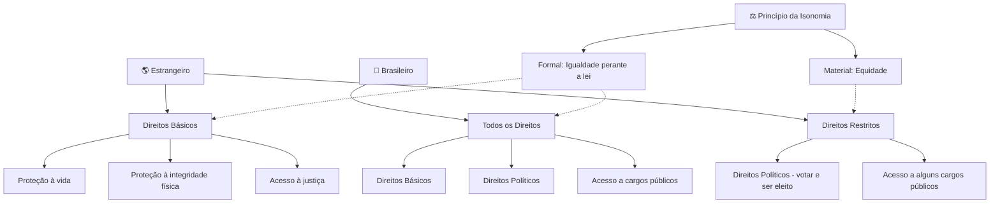

# 📜 TÍTULO II – Direitos e Garantias Fundamentais  

## 📖 Capítulo I – Direitos e Deveres Individuais e Coletivos  

### ⚖️ Art. 5º (TJ-SP 2007)  
**<mark style="background: #FF5582A6;">Todos são iguais perante a lei</mark>**, sem distinção de qualquer natureza, garantindo-se aos **🇧🇷 brasileiros** e aos **🌎 estrangeiros residentes no país** a **<mark style="background: #FF5582A6;">inviolabilidade</mark> do direito à vida, à liberdade, à igualdade, à segurança e à propriedade**, nos termos seguintes:  

**⚠️ Observação:**  
- Inviolabilidade deve ser entendida **considerando sua relatividade**, dependendo do contexto jurídico e social.  
  **Exemplos:**
  - 🏥 **Direito à vida:** pode haver discussão sobre tratamentos médicos obrigatórios ou decisões de pacientes em estado terminal.
  - 🗣️ **Liberdade:** a liberdade de expressão existe, mas não pode infringir direitos de terceiros (difamação, discurso de ódio).
  - ⚖️ **Propriedade:** a propriedade é inviolável, mas pode sofrer **intervenções legais**, como desapropriação por utilidade pública.
- Use este conceito para fundamentar **análises e estudos de casos**, relacionando teoria e prática.

### 📌 Princípio da Isonomia

O **Princípio da Isonomia** garante que todos tenham **igualdade perante a lei**, mas existem duas formas de aplicação:

---

**1️⃣ Isonomia Formal**  
- Todos são **iguais perante a lei**, sem qualquer distinção.  
- Trata todos da **mesma forma**, independentemente de suas diferenças.  
- **Exemplo:** A lei de trânsito vale para todos, sem distinção de classe, idade ou gênero.

---

**2️⃣ Isonomia Material (ou Substantiva)**  
- Reconhece que pessoas podem ser **iguais em direitos, mas desiguais em condições**.  
- Permite tratamento **diferenciado para alcançar equidade**, corrigindo desigualdades sociais ou individuais.  
- **Exemplo 1:** Políticas de cotas para minorias em universidades.  
- **Exemplo 2:** Licença maternidade maior que licença paternidade para garantir proteção à mãe e à criança.  
- **Exemplo 3:** Prazos diferenciados em processos para pessoas com vulnerabilidades reconhecidas.

Perfeito! Aqui está uma versão **pronta para Obsidian**, usando **Mermaid** para mostrar os direitos de estrangeiros vs. brasileiros e a relação com isonomia e equidade:

✅ **Como interpretar:**
- Linhas sólidas → direitos garantidos.  
- Linhas tracejadas → aplicação do princípio da isonomia e equidade para justificar diferenças.  
- Mostra que **estrangeiros têm direitos básicos, mas podem ter restrições**, e que isso é **compatível com a isonomia material**.  
---

<mark style="background: #FF5582A6;">💡 Resumo:</mark>  
- **Formal:** igualdade de tratamento, todos iguais perante a lei.  
- **Material:** igualdade real, ajustando o tratamento conforme as diferenças individuais ou sociais para promover justiça.

💡 **STF:** os direitos e garantias fundamentais são aplicados a todos, sejam brasileiros ou estrangeiros, **residentes ou não**.  
👉 Se a questão pedir **“nos termos da Constituição Federal”** e mencionar apenas **estrangeiros residentes**, também estará correta.  

---

### 📌 Incisos do Art. 5o  

1. 👩‍🦰👨‍🦱 **Homens e mulheres são iguais** em direitos e obrigações (CF).  
2. 📜 **Ninguém será obrigado** a fazer ou deixar de fazer alguma coisa, senão em virtude de **lei**.  (Principio da legalidade)
3. 🚫 **Ninguém será submetido** a **tortura** nem a tratamento **desumano ou degradante**.  
4. 🗣️ (TJ-SP 2012) **Livre manifestação do pensamento**, sendo **vedado o anonimato**.  
5. ✍️ (TJ-SP 2024) **Direito de resposta** proporcional ao agravo + **indenização** por dano material, moral ou à imagem.  
6. 🙏 (TJ-SP 2010/12/24) **Liberdade de consciência e de crença**: livre exercício dos cultos religiosos e proteção aos locais e liturgias.  
7. 🏥 (TJ-SP 2010) **Assistência religiosa** assegurada em entidades civis e militares de internação coletiva.  
8. ✝️ **Ninguém será privado de direitos** por motivo de crença religiosa ou convicção filosófica/política, salvo se invocadas para:  
   - ❌ Eximir-se de obrigação legal a todos imposta.  
   - ❌ Recusar-se a cumprir **prestação alternativa prevista em lei**.  
   👉 **Escusa de consciência:** regra = não perde direitos; exceção = descumprimento da prestação alternativa.  
9. 🎨 (TJ-SP 2014/24) **Livre expressão da atividade intelectual, artística, científica e de comunicação**, independentemente de censura ou licença.  
10. 🔒 **Inviolabilidade da intimidade, vida privada, honra e imagem**, assegurado o direito a **indenização** por dano material ou moral decorrente da violação.  

---
