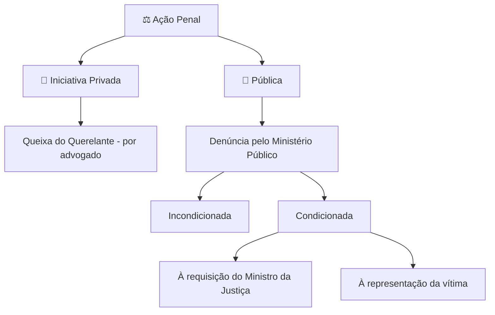

# ⚖️ **Direito Processual Penal**

**Professora:** Renata Sonnewend
**Disciplina:** Processo Penal

---

## 📌 **Últimos Editais**

**Código de Processo Penal** – alterações vigentes até a publicação do edital:

* Artigos: 251 a 258; 261 a 267; 274; 351 a 372; 394 a 497; 531 a 538; 541 a 548; 574 a 667
* **Lei nº 9.099/1995** – artigos 60 a 83; 88 e 89

---

## 🧾 **Conceito**

O **Processo Penal** é o conjunto de princípios e normas que disciplinam a **composição das lides penais**, por meio da aplicação do **Direito Penal objetivo**.

Características:

* É uma **disciplina autônoma**, possuindo **objeto e princípios próprios**.
* **Objetivo principal:** possibilitar a realização da **pretensão punitiva** derivada da prática de um ilícito penal.
* Também é chamado de **disciplina instrumental**, pois aplica o **direito penal** em casos concretos.

---

## ⚖️ **Direito Processual Penal**

### 🔍 **Perseguição Penal**

A **perseguição penal** envolve a **investigação** e o **processo**, sendo a etapa em que o Estado apura a prática de um ilícito penal e decide se há condições para iniciar a ação penal.

---

### 🧩 **Justa Causa**

Para o **ingresso da ação penal**, é necessário que haja:

* **Prova da materialidade** do crime (ex.: corpo, objeto, documentos)
* **Indícios suficientes de autoria** (quem cometeu o fato)

> ✅ Se ambos os elementos estiverem presentes, configura-se a **justa causa**, permitindo que o Ministério Público ou o ofendido (dependendo do tipo de ação) proponha a ação penal.

---

### 💡 Dica de Memorização

* **Materialidade + Autoria = Justa Causa**
* Sem justa causa, **não se pode iniciar a ação penal**.

---

## 🔹 **Estrutura do Processo Penal**

| Etapa             | Descrição                                                        |
| ----------------- | ---------------------------------------------------------------- |
| Investigação      | Apuração do fato e coleta de provas.                             |
| Perseguição Penal | Acompanhamento do caso pelo Estado para aplicação da lei.        |
| Ação Penal        | Direito de provocar o Estado a aplicar o direito penal objetivo. |

> ⚠️ A **ação penal** é o direito do Estado, único titular do **jus puniendi**, de satisfazer sua pretensão punitiva.

---

## 📝 **Tipos de Ação Penal**

![[Pasted image 20250917090420.png]]

| Tipo                       | Iniciativa                                                 |
| -------------------------- | ---------------------------------------------------------- |
| **Privada**                | Por meio de **queixa** do ofendido (ou seu advogado).      |
| **Pública Condicionada**   | Pelo Ministério Público **após representação da vítima**.  |
| **Pública Incondicionada** | Pelo Ministério Público **independente de representação**. |

**Denúncia / Queixa:**

* **Denúncia:** feita pelo **Ministério Público**
* **Queixa:** feita pelo **ofendido** (ou seu advogado)

## ⚖️ Ação Penal

A **ação penal** é o instrumento pelo qual o Estado busca a responsabilização criminal de alguém. Ela se divide em **ação penal pública** e **ação penal privada**, dependendo de quem tem a titularidade do direito de iniciar o processo.

---

### 1️⃣ Ação Penal Pública

* **Titular**: Ministério Público
* **Como se inicia**: por meio de **denúncia**.
* **Subtipos**:

  1. **Incondicionada**

     * O Ministério Público pode agir **independentemente da vontade da vítima**.
     * Ex.: homicídio, roubo, estelionato.
  2. **Condicionada**

     * O MP só pode agir **se houver iniciativa específica**:

       * **À representação da vítima**: quando a lei exige que a vítima manifeste interesse em que o crime seja processado.

         * Ex.: lesão corporal leve (art. 129, §9º do CP)
       * **À requisição do Ministro da Justiça**: quando a lei condiciona a ação penal à intervenção do Ministro da Justiça.

         * Ex.: crimes políticos contra a segurança do Estado.

---

### 2️⃣ Ação Penal Privada

* **Titular**: vítima (ou querelante)
* **Como se inicia**: por meio de **queixa-crime**, geralmente apresentada **por advogado**.
* **Exemplo**: calúnia, difamação, injúria.
* Diferente da ação pública, **não cabe ao Ministério Público promover a ação**, salvo quando houver representação do querelante ou nas hipóteses previstas em lei.

---

## ❓ **Exemplo de Questão**

> **Ano:** 2019 – Órgão: TJ-PR
> **Prova:** Técnico Judiciário
>
> A ação penal pública **incondicionada** é promovida mediante:
> (A) Queixa pela vítima
> (B) Queixa pelo Ministério Público
> (C) Denúncia pela vítima
> ==(D) Denúncia pelo Ministério Público==
> (E) Queixa pelo Ministério Público após representação da vítima

---

---

# ⚖️ **Direito Processual Penal – Explicação**

O **Direito Processual Penal** é a disciplina que regula **como o Estado aplica o Direito Penal** a casos concretos. Ele trata da **perseguição e responsabilização penal**, ou seja, como o Estado investiga crimes e pune quem os comete.

### 1️⃣ Conceito

* Conjunto de **princípios e normas** que disciplinam a **resolução de conflitos penais**.
* É uma disciplina **autônoma**, com **princípios e objetivos próprios**.
* É chamada de **instrumental**, porque **aplica o direito penal** aos fatos concretos.
* Objetivo principal: **realizar a pretensão punitiva do Estado**, garantindo justiça.

---

### 2️⃣ Perseguição Penal

**Perseguição penal** é a fase em que o **Estado investiga e processa** a prática de um crime.
Para iniciar o processo, é necessária a **justa causa**, que exige:

1. **Prova da materialidade** do crime → evidências de que o fato ocorreu (documentos, objetos, corpo do delito).
2. **Indícios suficientes de autoria** → sinais de quem cometeu o crime.

> ✅ Lembrete de memorização: **Materialidade + Autoria = Justa Causa**
> Sem justa causa, **não se inicia a ação penal**.

---

### 3️⃣ Estrutura do Processo Penal

O processo penal pode ser dividido em três grandes etapas:

| Etapa             | Descrição                                                   |
| ----------------- | ----------------------------------------------------------- |
| Investigação      | Apuração do fato e coleta de provas.                        |
| Perseguição Penal | Acompanhamento do caso pelo Estado.                         |
| Ação Penal        | Instrumento para levar o caso à responsabilização criminal. |

> ⚠️ A ação penal é o **direito do Estado** (MP), que é o titular do **jus puniendi**.

---

### 4️⃣ Tipos de Ação Penal

A **ação penal** é o meio pelo qual o Estado busca responsabilizar alguém criminalmente. Ela se divide em:

#### 🔹 Ação Penal Pública

* **Titular:** Ministério Público
* **Início:** **denúncia** do MP
* **Subtipos:**

  1. **Incondicionada** → MP atua **independentemente da vítima**.
     Ex.: homicídio, roubo.
  2. **Condicionada** → depende de **iniciativa específica**:

     * **À representação da vítima** → crime só é processado se a vítima manifestar interesse.
       Ex.: lesão corporal leve.
     * **À requisição do Ministro da Justiça** → casos específicos, como crimes políticos.

#### 🔹 Ação Penal Privada

* **Titular:** vítima ou querelante
* **Início:** **queixa-crime**, geralmente apresentada por advogado
* **Exemplos:** calúnia, difamação, injúria
* O MP **não atua diretamente**, exceto quando previsto em lei.

---

### 6️⃣ Dica para Concurso

* Sempre identifique **quem é o titular da ação penal** (MP ou vítima).
* Memorize os **subtipos da ação pública** (incondicionada/condicionada).
* Lembre: **justa causa** é requisito mínimo para iniciar qualquer ação penal.

---

### 7️⃣ Exemplo de Questão

> A ação penal pública **incondicionada** é promovida mediante:
> (A) Queixa pela vítima
> (B) Queixa pelo Ministério Público
> (C) Denúncia pela vítima
> (D) **Denúncia pelo Ministério Público** ✅
> (E) Queixa pelo Ministério Público após representação da vítima

**Explicação:** A ação pública incondicionada é **denúncia do MP**, ou seja, independe da vontade da vítima.
