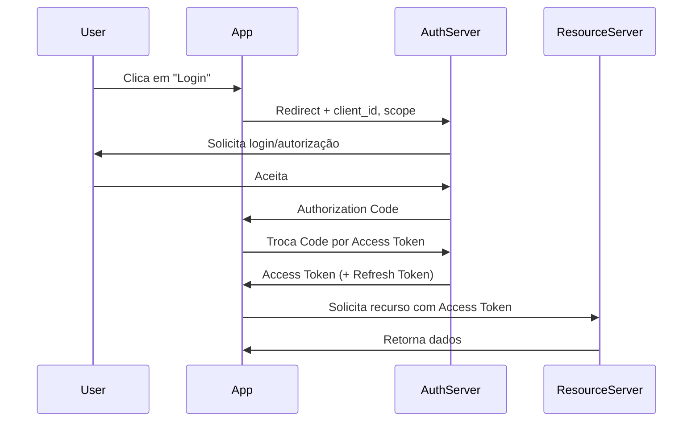
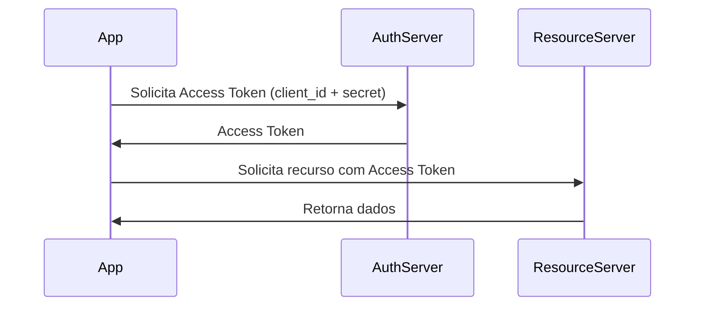
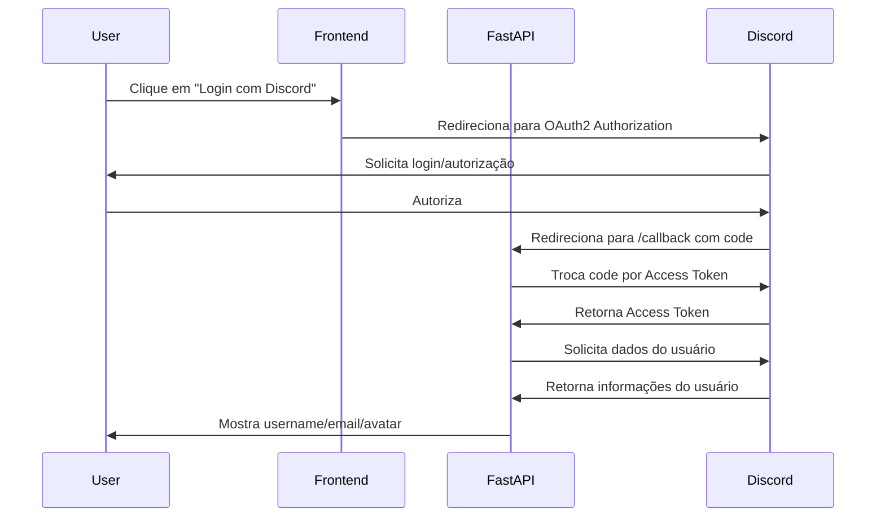

Perfeito! Vou criar um **note completo para Obsidian**, com **exemplos práticos em Python (FastAPI/Flask) para backend**, e **diagramas/fluxos explicativos**, já no estilo que você pode colar direto na nota.

---

# OAuth2 – Fluxos de Autenticação (Backend Python)

**Tags:** `#Segurança` `#Autenticação` `#OAuth2` `#Python` `#Backend`

---

## 1. Introdução

OAuth 2.0 é um protocolo de **autorização** que permite que aplicações acessem recursos de usuários **sem expor credenciais**.

No backend, geralmente usamos **Authorization Code Flow** ou **Client Credentials Flow** para serviços server-side.

---

## 2. Fluxos com Diagramas

### 2.1 Authorization Code Flow



* **Uso:** Aplicações web com backend seguro.
* **Tokens:** Access Token + Refresh Token.

---

### 2.2 Client Credentials Flow (App-to-App)



* **Uso:** Serviços backend, microservices, APIs internas.
* **Tokens:** Apenas Access Token.

---

## 3. Exemplos Python – Backend

### 3.1 FastAPI + OAuth2 (Authorization Code Flow)

```python
from fastapi import FastAPI, Depends
from fastapi.security import OAuth2AuthorizationCodeBearer
import requests

app = FastAPI()

oauth2_scheme = OAuth2AuthorizationCodeBearer(
    authorizationUrl="https://authserver.com/auth",
    tokenUrl="https://authserver.com/token"
)

@app.get("/me")
async def read_users_me(token: str = Depends(oauth2_scheme)):
    # Exemplo simples de requisição para API de recurso
    response = requests.get(
        "https://api.resource.com/userinfo",
        headers={"Authorization": f"Bearer {token}"}
    )
    return response.json()
```

---

### 3.2 Flask + Client Credentials Flow

```python
from flask import Flask, jsonify
import requests

app = Flask(__name__)

CLIENT_ID = "seu_client_id"
CLIENT_SECRET = "seu_client_secret"
TOKEN_URL = "https://authserver.com/token"

def get_access_token():
    data = {
        "grant_type": "client_credentials",
        "client_id": CLIENT_ID,
        "client_secret": CLIENT_SECRET
    }
    r = requests.post(TOKEN_URL, data=data)
    return r.json()["access_token"]

@app.route("/data")
def get_data():
    token = get_access_token()
    r = requests.get(
        "https://api.resource.com/data",
        headers={"Authorization": f"Bearer {token}"}
    )
    return jsonify(r.json())
```

---

## 4. Boas práticas no Backend

1. **Nunca expor client secrets no frontend.**
2. **Usar HTTPS sempre** para requisições de token e API.
3. **Validar assinatura e expiração do token** antes de aceitar requests.
4. **Refresh Tokens** devem ser armazenados com segurança.
5. Para SPAs, usar **Authorization Code Flow com PKCE**, mantendo o token seguro no backend.

---

## 5. Recursos / Links

* [RFC 6749 – OAuth 2.0](https://datatracker.ietf.org/doc/html/rfc6749)
* [FastAPI OAuth2 Tutorial](https://fastapi.tiangolo.com/tutorial/security/oauth2-jwt/)
* [Flask OAuth2](https://flask-oauthlib.readthedocs.io/en/latest/)
* \[\[JWT]] – para validar tokens
* \[\[PKCE]] – extensão de segurança


## 1. Setup do Discord

1. Crie uma aplicação no [Discord Developer Portal](https://discord.com/developers/applications).
    
2. Anote:
    
    - **Client ID**
        
    - **Client Secret**
        
    - **Redirect URI** (ex.: `http://localhost:8000/callback`)
        
3. Configure escopos OAuth2:
    
    - `identify` (obrigatório para pegar username/avatar)
        
    - `email` (opcional)
        

---

## 2. HTML – Frontend simples

```html
<!DOCTYPE html>
<html lang="pt-br">
<head>
    <meta charset="UTF-8">
    <title>Login com Discord</title>
</head>
<body>
    <h1>Login com Discord</h1>
    <a href="https://discord.com/api/oauth2/authorize?client_id=SEU_CLIENT_ID&redirect_uri=http%3A%2F%2Flocalhost%3A8000%2Fcallback&response_type=code&scope=identify%20email">
        Entrar com Discord
    </a>
</body>
</html>
```

- **Observação:** Substitua `SEU_CLIENT_ID` e `redirect_uri` corretamente.
    
- Quando o usuário clica, ele será redirecionado para o Discord para autorizar o app.
    

---

## 3. Backend em Python (FastAPI)

```python
from fastapi import FastAPI, Request
import requests
from fastapi.responses import RedirectResponse

app = FastAPI()

CLIENT_ID = "1233086097760845868"
CLIENT_SECRET = "M4K3kh3QHn-mK_jxivBIIf_IEgyaNecc"
REDIRECT_URI = "http://localhost:8000/callback"

TOKEN_URL = "https://discord.com/api/oauth2/token"
USER_URL = "https://discord.com/api/users/@me"

@app.get("/")
def home():
    return RedirectResponse(url="/login.html")

@app.get("/callback")
def callback(code: str):
    # Trocar code por access token
    data = {
        "client_id": CLIENT_ID,
        "client_secret": CLIENT_SECRET,
        "grant_type": "authorization_code",
        "code": code,
        "redirect_uri": REDIRECT_URI,
    }
    headers = {"Content-Type": "application/x-www-form-urlencoded"}
    r = requests.post(TOKEN_URL, data=data, headers=headers)
    token_info = r.json()
    
    access_token = token_info.get("access_token")
    
    # Pegar informações do usuário
    headers = {"Authorization": f"Bearer {access_token}"}
    user_resp = requests.get(USER_URL, headers=headers)
    user_data = user_resp.json()
    
    return user_data
```

---

## 4. Como funciona o fluxo



---

## 5. Boas práticas

1. **Usar HTTPS** para deploy real.
    
2. Nunca expor o **client secret** no frontend.
    
3. Validar **expiração de token** e **escopos**.
    
4. Armazenar o token de forma segura se quiser sessão persistente.
    

---

Se você quiser, posso criar **uma versão completa com HTML + CSS + JS moderno**, mostrando **o perfil do usuário do Discord na página**, já integrado com FastAPI e pronto para **rodar localmente ou deploy**.

Quer que eu faça isso?